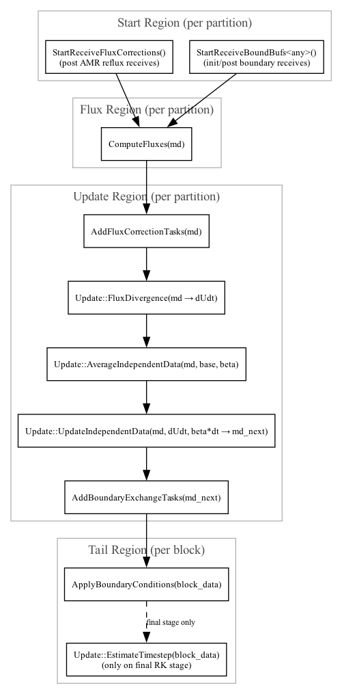

# Euler Sparse Example: How-To

This guide explains how this repository implements a minimal Parthenon-based hyperbolic PDE solver using sparse fields, typed SparsePacks, task-based time integration, and coalesced communication. It mirrors the current code under `src/` so you can map concepts directly to implementation.

## Build and Run

- Init submodules: `git submodule update --init --recursive`

- Standalone configure + build (top-level drives Parthenon + this example):
  - `cmake -S . -B build [-DPARTHENON_ENABLE_MPI=ON -DPARTHENON_ENABLE_OPENMP=ON ...]`
  - `cmake --build build -j`
- Pass Parthenon options at configure time (MPI/OpenMP/HDF5/Kokkos backend) as needed.
- Run from the build tree:
  - `build/src/euler_sparse-example -i parthinput.euler_sparse`

## Overview of Components

- Package: declares conserved variables using one SparsePool per state variable: `rho`, `mom`, and `E`. The package also exposes runtime params and hooks. See `src/euler_package.cpp:Initialize`.
- Problem generator: allocates sparse IDs and initializes state via a typed SparsePack. See `src/parthenon_app_inputs.cpp:ProblemGenerator`.
- Fluxes: computes Rusanov fluxes in X1 and X2 using typed `MakePackDescriptor` with `WithFluxes`. See `src/euler_package.cpp:ComputeFluxes`.
- Driver: orchestrates receives, flux compute, divergence, update, and boundary exchanges across `MeshData` partitions. See `src/euler_driver.cpp:MakeTaskCollection`.
- Timestep: estimates `dt` from wavespeeds. See `src/euler_package.cpp:EstimateTimestepBlock`.

## Declaring Sparse Conserved Variables (one pool per state var)

We model density (`rho`), momentum (`mom[3]`), and total energy (`E`) using separate SparsePools — one per state variable — with fluxes and ghost fills enabled. For a single material, we allocate sparse ID 0 in each pool, yielding variable labels `rho_0`, `mom_0`, and `E_0`:

```c++
// src/euler_package.cpp:Initialize
Metadata m({Metadata::Cell, Metadata::Independent, Metadata::WithFluxes,
            Metadata::FillGhost, Metadata::Sparse});

// Density pool
{
  SparsePool rho_pool("rho", m);
  rho_pool.Add(0, std::vector<int>{1}, std::vector<std::string>{"rho"});
  pkg->AddSparsePool(rho_pool);
}

// Momentum (vector<3>) pool
{
  SparsePool mom_pool("mom", m);
  mom_pool.Add(0, std::vector<int>{3}, Metadata::Vector,
               std::vector<std::string>{"mom_x", "mom_y", "mom_z"});
  pkg->AddSparsePool(mom_pool);
}

// Total energy pool
{
  SparsePool E_pool("E", m);
  E_pool.Add(0, std::vector<int>{1}, std::vector<std::string>{"E"});
  pkg->AddSparsePool(E_pool);
}
```

Typed tags for SparsePack access are defined in `src/euler_package.hpp` under `namespace U`. Important: sparse variable labels in Parthenon use the base name plus sparse ID, so `rho_0`, `mom_0`, and `E_0` correspond to the density, momentum, and energy variables in this example. The tags encapsulate this naming.

Runtime parameters (gamma, cfl) are read from the input file and stored on the package.

## Allocating and Initializing State

The problem generator allocates the needed sparse IDs (ID 0 in each pool) on each MeshBlock and initializes fields using a typed pack:

```c++
// src/parthenon_app_inputs.cpp:ProblemGenerator
pmb->AllocSparseID("rho", 0);
pmb->AllocSparseID("mom", 0);
pmb->AllocSparseID("E", 0);

using euler_sparse_example::U::rho;
using euler_sparse_example::U::mom;
using euler_sparse_example::U::E;
auto desc = parthenon::MakePackDescriptor<rho, mom, E>(data.get());
auto pack = desc.GetPack(data.get());

pmb->par_for(PARTHENON_AUTO_LABEL, kb.s, kb.e, jb.s, jb.e, ib.s, ib.e,
             KOKKOS_LAMBDA(const int k, const int j, const int i) {
  // block index 0 for MeshBlockData packs
  pack(0, rho(), k, j, i) = ...;
  pack(0, E(),   k, j, i) = ...;
  if (pack.Contains(0, mom())) {
    pack(0, mom(0), k, j, i) = 0.0;
    pack(0, mom(1), k, j, i) = 0.0;
    pack(0, mom(2), k, j, i) = 0.0;
  }
});
```

## Flux Computation with Typed SparsePack

Fluxes are computed over all MeshBlocks at once using a typed `MakePackDescriptor<rho, mom, E>(..., PDOpt::WithFluxes)`, then iterating with a block-aware outer loop and an inner i-loop. A Rusanov (HLL) solver is used in X1 and, when 2D+, in X2.

```c++
// src/euler_package.cpp:ComputeFluxes (excerpt)
auto desc = parthenon::MakePackDescriptor<rho, mom, E>(
    md, std::vector<parthenon::MetadataFlag>{},
    std::set<parthenon::PDOpt>{parthenon::PDOpt::WithFluxes});
auto pack = desc.GetPack(md);

const int nblocks = md->NumBlocks();

// X1 fluxes: outer loops over block b, k, j; inner over faces i in [ib.s, ib.e+1]
parthenon::par_for_outer(
    DEFAULT_OUTER_LOOP_PATTERN, PARTHENON_AUTO_LABEL, DevExecSpace(), scratch_size,
    scratch_level, 0, nblocks - 1, kb.s, kb.e, jb.s, jb.e,
    KOKKOS_LAMBDA(parthenon::team_mbr_t member, const int b, const int k, const int j) {
      if (!(pack.Contains(b, rho()) && pack.Contains(b, mom()) && pack.Contains(b, E())))
        return;

      // Take raw pointers to contiguous i-slices for speed
      Real *rho_bkj = &pack(b, rho(),   k, j, 0);
      Real *mx_bkj  = &pack(b, mom(0), k, j, 0);
      Real *my_bkj  = &pack(b, mom(1), k, j, 0);
      Real *mz_bkj  = &pack(b, mom(2), k, j, 0);
      Real *E_bkj   = &pack(b, E(),     k, j, 0);

      Real *Fx_rho = &pack.flux(b, 1, rho(),   k, j, 0);
      Real *Fx_mx  = &pack.flux(b, 1, mom(0),  k, j, 0);
      Real *Fx_my  = &pack.flux(b, 1, mom(1),  k, j, 0);
      Real *Fx_mz  = &pack.flux(b, 1, mom(2),  k, j, 0);
      Real *Fx_E   = &pack.flux(b, 1, E(),     k, j, 0);

      parthenon::par_for_inner(member, ib.s, ib.e + 1, [&](const int i) {
        const int iL = i - 1, iR = i;
        // compute HLL flux using left/right states from rho_bkj[iL/R], ...
        // write to Fx_*[i]
      });
    });

// X2 fluxes (if ndim >= 2): outer j over faces [jb.s, jb.e+1], inner i over [ib.s, ib.e]
if (pm->ndim >= 2) {
  parthenon::par_for_outer(
      DEFAULT_OUTER_LOOP_PATTERN, PARTHENON_AUTO_LABEL, DevExecSpace(), scratch_size,
      scratch_level, 0, nblocks - 1, kb.s, kb.e, jb.s, jb.e + 1,
      KOKKOS_LAMBDA(parthenon::team_mbr_t member, const int b, const int k, const int j) {
        if (!(pack.Contains(b, rho()) && pack.Contains(b, mom()) && pack.Contains(b, E())))
          return;

        const int jL = j - 1, jR = j;
        // take jL/jR i-slices, compute HLL flux, and write to pack.flux(b, 2, ...)
        parthenon::par_for_inner(member, ib.s, ib.e, [&](const int i) {
          // compute and store Fy_*[i]
        });
      });
}
```

Key changes in the new loop structure:
- MeshData-based pack and block-aware Contains checks (`pack.Contains(b, ...)`).
- `par_for_outer` over `(b, k, j)` for X1 and `(b, k, j_face)` for X2.
- Use pointer slices to contiguous i-lines and `par_for_inner` for face loops.

Helper conversions (conserved → primitive and sound speed) remain alongside the flux routine.

## Multi-Stage Driver and Task Graph

`src/euler_driver.cpp:MakeTaskCollection` follows this ordering per stage:

- Note: `ComputeFluxes` operates on a `MeshData` partition covering multiple blocks. The driver builds per-stage `MeshData` views and passes them into `ComputeFluxes`, which then iterates over blocks internally using the block-aware `par_for_outer` loops described above. This improves overlap with communication and keeps flux evaluation contiguous in memory along i-lines.

Call site in the driver:

```c++
// src/euler_driver.cpp: Flux computation task (MeshData partition)
auto &region_flux = tc.AddRegion(num_partitions);
for (int i = 0; i < num_partitions; i++) {
  auto &tl = region_flux[i];
  auto &mbase = pmesh->mesh_data.Add("base", partitions[i]);
  auto &mc0 = pmesh->mesh_data.Add(stage_name[stage - 1], mbase);
  tl.AddTask(
      none,
      TF(static_cast<parthenon::TaskStatus (*)(parthenon::MeshData<Real> *)>(
          euler_sparse_example::ComputeFluxes)),
      mc0.get());
}
```

Exact location: `src/euler_driver.cpp:34`.

1) Start receives early on `MeshData` partitions
   - `StartReceiveFluxCorrections`, `StartReceiveBoundBufs<any>`
2) Per-block flux computation
   - Build `base` and stage views, call `ComputeFluxes`
3) Partitioned divergence, averaging, update, and boundary exchange
   - `AddFluxCorrectionTasks`, `FluxDivergence`, `AverageIndependentData`, `UpdateIndependentData`
   - `AddBoundaryExchangeTasks(update, ...)`
4) Tail tasks per block
   - `ApplyBoundaryConditions`, and on final stage `EstimateTimestep`

AMR tagging is not implemented in this example but can be added in the tail region when adaptive meshes are enabled.

Task graph: The figure below illustrates the per-stage task dependencies constructed in `MakeTaskCollection`. Each node is a task and arrows denote dependencies and execution order across `MeshData` partitions. The image was generated from `task_graph.dot`.



## Timestep Estimation

`src/euler_package.cpp:EstimateTimestepBlock` computes a stable `dt` based on the maximum characteristic speed per direction using the package `gamma` and the mesh metrics. The driver scales this by `cfl` from the input file.

## Coalesced Buffer Communication

Coalesced comms aggregate neighbor messages into fewer, larger messages without API changes. Enable at runtime in the input file:

```
[parthenon/mesh]
do_coalesced_comms = true
```

With this set, boundary exchanges initiated via `StartReceiveBoundBufs`, `AddBoundaryExchangeTasks`, and flux corrections use the coalesced paths. Sparse variables are supported (including null messages when a component is not allocated).

## Input File

`parthinput.euler_sparse` configures the mesh, time integrator, and Euler app parameters. Relevant keys under `[euler]` include `gamma`, `cfl`, `rho0`, `p0`, `drho`, `dp`, and blob geometry for the initial condition. For outputs, select variables explicitly, e.g. `variables = rho, mom, E` (or the specific sparse labels like `rho_0`, `mom_0`, `E_0`).

## Physics/ICs

- Setup: a stationary pressure/density “blob” in a periodic box. Inside a radius `blob_radius` centered at `(blob_x0, blob_y0, 0)`, density and pressure are raised by `drho` and `dp` relative to `rho0` and `p0`.
- Momentum: initialized to zero everywhere (`mom = 0`).
- Energy: total energy is set to internal energy since velocity is zero, `E = p/(gamma-1)`. If you introduce velocity, remember to add kinetic energy: `E = p/(gamma-1) + 0.5*rho*(u^2+v^2+w^2)`.
- Dimensionality: example input uses 2D (`nx3=1`), periodic BCs on all faces, and coalesced comms enabled.
- Tweaking the blob: increase `drho` and/or `dp` to strengthen the perturbation; shift `(blob_x0, blob_y0)` to move the blob; adjust `tlim`/`dt` to control runtime.

## Where to Look

- Entry point: `src/main.cpp`
- Driver and tasks: `src/euler_driver.hpp`, `src/euler_driver.cpp`
- Package (vars, fluxes, dt): `src/euler_package.hpp`, `src/euler_package.cpp`
- Problem generator + package registration: `src/parthenon_app_inputs.cpp`
- Parthenon internals referenced by this example (from submodule):
  - Packs: `extern/parthenon/src/pack/`
  - Boundary comms (coalesced): `extern/parthenon/src/bvals/comms/`
  - Update utilities: `extern/parthenon/src/time_integration/` and `extern/parthenon/src/outputs/`

## Tips and Pitfalls

- Allocation: allocate sparse IDs on the host (`AllocSparseID`) and guard device work with `pack.Contains(...)`. Use one SparsePool per state variable; add additional sparse IDs per pool if modeling multiple materials.
- Metadata: include `WithFluxes` for fields updated by flux divergence and `FillGhost` for halo exchange; use `Metadata::Vector` for multi-component momentum.
- Packs: prefer typed tags (`MakePackDescriptor<...>`) for safety and performance; request `PDOpt::WithFluxes` when you need flux arrays.
- Task ordering: start receives before compute to maximize overlap; operate on `MeshData` partitions for better communication/computation overlap.

With these pieces, this example provides a compact, consistent template for sparse hyperbolic solvers that benefit from Parthenon’s tasking, typed SparsePacks, and coalesced communication.

## What parthenon::Update::FluxDivergence Does

`parthenon::Update::FluxDivergence` computes the finite-volume flux divergence and writes it into a `dudt` container for all cell-centered variables that have flux arrays (`Metadata::WithFluxes`). Concretely, per cell and per component it evaluates

```
dudt = -(1/CellVolume) * [
  A_x F_x(i+1) - A_x F_x(i)
  + (if ndim >= 2) A_y F_y(j+1) - A_y F_y(j)
  + (if ndim == 3) A_z F_z(k+1) - A_z F_z(k)
]
```

Key points:
- Operates on interior zones only; respects variable allocation checks.
- Uses mesh geometry for face areas and cell volumes.
- Works on both `MeshBlockData<Real>` and `MeshData<Real>` packs.
- Returns `TaskStatus::complete` and is typically followed by update steps (e.g., `UpdateIndependentData` or low-storage integrator updates).

Reference implementation in the Parthenon submodule:
- Header with helper routine: `extern/parthenon/src/interface/update.hpp`
- Definitions for `MeshBlockData`/`MeshData` specializations: `extern/parthenon/src/interface/update.cpp`
